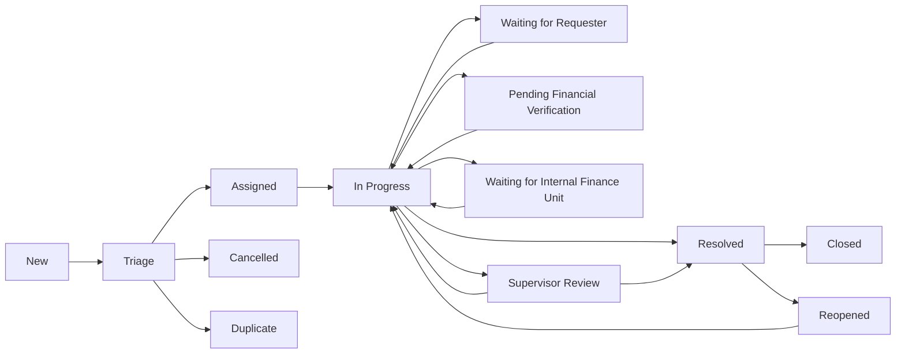

# Accounts Domain, Role, and Workflow Redesign

**Date:** 2026-07-29
**Status:** Approved design; awaiting written-spec review
**Application:** MHC Service Desk
**Primary stakeholders:** Master of the High Court staff, service-desk management, Accounts, IT, Operational teams, Security, and Audit

## 1. Objective

Redesign ticket routing, allocation, role-based access, and work management so that:

- authenticated MHC staff can receive, self-assign, or be allocated eligible tickets and action them;
- administrative service-desk staff can monitor work across business domains and assign or reassign tickets;
- financial enquiries are handled in a separate Accounts domain;
- Accounts handles enquiries about payments, invoices, refunds, fees, receipts, and their status, but does not execute or approve financial transactions;
- Keycloak roles grant only the access required for each job function; and
- allocation, routing, status changes, notifications, and access decisions remain auditable and safe under concurrent use.

The term **service-desk manager** in this document means administrative staff responsible for monitoring and allocation. It does not mean a technical system administrator.

## 2. Current State and Gaps

The application currently supports Operational and IT domains. Domain agents can work eligible tickets, while Operational supervisors, IT leads, and system administrators have broader assignment or configuration permissions. The existing design has these gaps:

- there is no separate Accounts domain, Accounts role set, or financial-enquiry workflow;
- cross-domain work monitoring and allocation are coupled to technical system administration;
- dashboards cover Operational and IT only;
- financial enquiries can only be mixed into an existing business domain;
- assignment is coupled to general work-state updates rather than expressed as one auditable allocation operation;
- system administrators receive routine business-ticket authority that is not required for technical administration; and
- the UI does not provide a single manager overview or a clear staff-focused My Work view.

## 3. Scope

### 3.1 Included

- a third business domain named `accounts`;
- Accounts agent and supervisor roles;
- a cross-domain service-desk manager role;
- revised staff, manager, system administrator, security, and auditor permissions;
- automatic catalogue-based routing and controlled manual rerouting;
- atomic assignment and self-assignment;
- a staff My Work view;
- Accounts queue, Kanban, dashboard, and ticket fields;
- a manager overview covering Operational, IT, and Accounts;
- Accounts-specific statuses and transition rules;
- notifications and audit events for routing and allocation;
- concurrency, error, and confidentiality rules;
- a controlled migration process for existing financial enquiries; and
- backend, frontend, Keycloak, permission, migration, and end-to-end tests.

### 3.2 Not Included

- taking payments;
- issuing refunds;
- approving fees, invoices, or financial adjustments;
- modifying authoritative finance records;
- storing payment-card data, bank credentials, PINs, passwords, or other financial credentials;
- replacing an accounting or payment platform; or
- granting ticket authority merely because a user administers infrastructure or Keycloak.

Accounts staff may investigate, verify, communicate, and record outcomes or references from an external finance system. Any actual transaction or financial approval remains in the authorised finance system and process.

## 4. Design Decisions

1. Accounts is a first-class domain, not an Operational subtype.
2. Catalogue configuration is the routing authority. Free-text keyword matching is not an authoritative routing mechanism.
3. Administrative service-desk staff use `service-desk-manager`; `system-admin` remains a technical role.
4. Roles are composable. A service-desk manager who must also action Accounts tickets needs both the manager and Accounts agent or supervisor roles.
5. Manager monitoring and allocation do not imply permission to reply, add internal notes, or resolve a ticket.
6. System administrators do not receive business-ticket visibility by default.
7. Accounts tickets default to Sensitive confidentiality; unusually sensitive cases are Restricted.
8. Restricted access remains separately controlled and is not granted to managers merely for monitoring.
9. Assignment and the move to Assigned happen atomically.
10. Existing tickets are never automatically moved into Accounts solely because text appears financial.

## 5. Identity and Role Model

### 5.1 Authentication

All staff access uses the configured MHC Keycloak realm and the `mhc-frontend` client. Production staff access must not fall back to a local demo identity.

Keycloak authority mappings are:

| Keycloak group | Effective group or realm-role claim | Application role |
|---|---|---|
| Baseline membership | `staff` | Authenticated Staff |
| `ops-agents` | `agent-operational` | Operational Agent |
| `ops-supervisors` | `supervisor-operational` | Operational Supervisor |
| `it-agents` | `agent-it` | IT Agent |
| `it-leads` | `lead-it` | IT Lead |
| `accounts-agents` | `agent-accounts` | Accounts Agent |
| `accounts-supervisors` | `supervisor-accounts` | Accounts Supervisor |
| `service-desk-managers` | `service-desk-manager` | Service Desk Manager |
| `security-responders` | `security-responders` group claim | Security Responder |
| `auditors` | `auditor` | Auditor |
| `system-admins` | `admin` | System Administrator |

Every functional staff group also receives the baseline `staff` realm role. The backend accepts only allowlisted MHC memberships from `realm_access.roles` or the configured Keycloak groups claim; both sources are normalised into the same authority model. Token claims remain the server-side source for application roles. The frontend may use capability hints for presentation, but the API must enforce every permission.

### 5.2 Capability Definitions

The permission layer must expose explicit capabilities rather than relying on broad role-name checks:

- `ticket.view`: read a ticket in allowed domain and confidentiality scope;
- `ticket.action`: reply, add an internal note, or perform an allowed work transition;
- `ticket.self_assign`: claim an unassigned eligible ticket for the current user;
- `ticket.assign`: allocate or reallocate to another eligible staff member;
- `ticket.reroute`: change domain, service, request type, office, or queue;
- `ticket.monitor`: view workload and operational reporting without gaining action authority;
- `ticket.view_restricted`: view Restricted tickets in an otherwise allowed scope; and
- `platform.administer`: administer technical configuration and identity integration without business-ticket authority.

### 5.3 Role and Authority Matrix

| Role | Domain scope | View | Action | Self-assign | Assign others | Reroute | Monitor | Restricted |
|---|---|---:|---:|---:|---:|---:|---:|---:|
| Authenticated Staff | None by default | No staff queue access | No | No | No | No | No | No |
| Operational Agent | Operational | Yes | Yes | Yes | No | No | Own/domain work | No |
| Operational Supervisor | Operational | Yes | Yes | Yes | Yes | Within Operational queue structure | Domain | Yes |
| IT Agent | IT | Yes | Yes | Yes | No | No | Own/domain work | No |
| IT Lead | IT | Yes | Yes | Yes | Yes | Within IT queue structure | Domain | Yes |
| Accounts Agent | Accounts | Yes | Yes | Yes | No | No | Own/domain work | No |
| Accounts Supervisor | Accounts | Yes | Yes | Yes | Yes | Within Accounts queue structure | Domain | Yes |
| Service Desk Manager | All three domains | Normal and Sensitive | No, unless combined with a domain role | No, unless combined with a domain role | Yes | Cross-domain | Cross-domain | No, unless combined with an eligible restricted role |
| Security Responder | All three domains | Restricted cases in security scope | No routine domain action unless combined with a domain role | No | No | No | Security scope | Yes |
| Auditor | All three domains | Read-only | No | No | No | No | Read-only reporting | Yes |
| System Administrator | None by default | No business-ticket access | No | No | No | No | Technical health/configuration only | No |

Additional rules:

- The baseline Staff role permits authentication but grants no ticket domain. A user must receive a functional role before entering staff queues or actioning tickets.
- An agent may self-assign only an unassigned ticket in the agent's domain and confidentiality scope.
- An agent may action only a ticket currently assigned to that agent, unless an approved domain-supervisor rule explicitly allows intervention.
- Domain supervisors and IT leads may assign only eligible users in their own domain.
- Only service-desk managers may reroute across business domains.
- Manager overview data is limited to tickets the manager may view. Restricted counts and details are excluded unless the user holds an additional role that grants Restricted access.
- Auditor access is read-only at both API and UI layers.
- A System Administrator who needs temporary business access must receive a separate, time-bounded business role through the normal access-governance process.

### 5.4 Public Requester

A public requester is not a staff role. Public requesters may submit an enquiry and use an authorised requester-facing tracking mechanism, but they cannot sign in to staff queues, see internal notes or reporting, allocate work, or action tickets.

## 6. Accounts Domain

### 6.1 Supported Enquiry Categories

Accounts manages enquiries only in these categories:

- payment;
- invoice;
- refund;
- fee;
- receipt; and
- financial status.

Each Accounts service contains one or more request types from these categories. The selected Service is the authoritative domain source; an Accounts request type cannot belong to a non-Accounts Service.

### 6.2 Ticket Data

Accounts tickets add the following structured fields:

| Field | Type | Rule |
|---|---|---|
| `financial_enquiry_category` | enum | Required for Accounts tickets |
| `financial_reference` | bounded string | Optional requester-facing payment, invoice, refund, fee, or receipt reference |
| `external_finance_reference` | bounded string | Optional reference from the authoritative finance system |
| `enquiry_amount` | decimal | Optional context only; never treated as an authoritative transaction value |
| `enquiry_currency` | ISO 4217 code | Required when an amount is supplied |
| `financial_verification_status` | enum | `not_required`, `pending`, `verified`, `not_found`, or `disputed` |
| `resolution_code` | enum | Required before resolution |
| `resolution_summary` | text | Required before resolution |
| `no_transaction_executed` | boolean affirmation | Must be true before resolution |

Reference fields must have server-side length and character validation. Amount and currency are enquiry context only. The UI and API must warn users never to enter card details, bank credentials, passwords, PINs, or authentication secrets.

### 6.3 Confidentiality

- New Accounts services default tickets to Sensitive.
- A configured request type or authorised user may elevate a case to Restricted.
- Confidentiality may never be lowered by an ordinary Accounts agent.
- Accounts supervisors may change confidentiality in their domain, subject to policy and audit.
- Service-desk managers may route Sensitive tickets but cannot view or route Restricted tickets without a second eligible role.

## 7. Intake and Routing

### 7.1 Authoritative Routing

The catalogue controls domain routing:

```text
Service.domain = operational | it | accounts
RequestType belongs to exactly one Service
Selected Service -> ticket domain
```

Financial request types must be created under Accounts services. Web, email, telephone, and integration intake must resolve to a configured Service and Request Type before normal queue placement.

Integration routing uses explicit configuration such as destination mailbox, telephone queue, sender/integration identity, or external mapping. It must not depend on uncontrolled keyword classification.

### 7.2 Routing Outcomes

- A valid configured route creates the ticket in the matching domain and unassigned queue.
- A missing or ambiguous route fails closed into a manager-triage exception queue; it must not guess a business domain.
- A service-desk manager may correct domain, service, request type, office, or queue.
- Every manual correction requires a reason and records old and new values.
- Cross-domain correction clears an assignee who is not eligible in the destination domain.
- Rerouting must preserve messages, attachments, SLA history, audit history, and external references.

## 8. Allocation and Staff Work

### 8.1 Unassigned Queues

Each domain has an unassigned queue. An eligible ticket can be allocated through:

1. self-assignment by an eligible domain agent;
2. assignment by an eligible domain supervisor or IT lead within that domain; or
3. assignment by a service-desk manager across the three domains.

The target user must be active, hold an eligible domain role, and have the required confidentiality access. Auditors, inactive staff, technical-only system administrators, and users in a different domain are invalid assignees.

### 8.2 Atomic Assignment

Allocation is a single transaction that:

1. checks ticket visibility and assignment authority;
2. checks the expected ticket version;
3. checks target-user eligibility;
4. sets the assignee;
5. changes the workflow status to Assigned when applicable;
6. writes an audit event with actor, target, reason, and old/new values; and
7. creates a durable assignment-notification event.

If any required step before durable notification creation fails, neither assignment nor status change is committed. Notification delivery may retry after commit and does not roll back a valid assignment.

### 8.3 My Work

Authenticated actioning staff receive a My Work view showing tickets assigned to them, with filters or groupings for:

- active work;
- waiting states;
- due soon;
- SLA at risk;
- SLA breached;
- overdue; and
- recently reassigned.

Assignment and reassignment update My Work immediately after the mutation succeeds. The assignee receives an in-application notification containing the ticket number, title, assigning user, and permitted destination link.

## 9. Management Oversight

The Manager Overview covers all visible Operational, IT, and Accounts tickets and provides:

- unassigned counts and oldest-unassigned age;
- assigned workload by eligible staff member;
- ticket ageing and priority distribution;
- active and waiting states;
- SLA due-soon, risk, and breach counts;
- domain, service, request type, office, queue, priority, assignee, and status filters; and
- drill-down to visible ticket lists.

A service-desk manager may allocate, reassign, correct routing, and adjust priority where policy permits. Reassignment and manual routing require a reason. These actions do not grant permission to reply, add internal notes, or resolve the ticket.

Domain dashboards remain available to the appropriate domain staff. A new Accounts Dashboard mirrors the relevant Operational and IT metrics but uses Accounts statuses and categories.

## 10. Accounts Workflow

### 10.1 Statuses

| Code | Display name | Meaning |
|---|---|---|
| `new` | New | Intake completed; not yet triaged |
| `triage` | Triage | Validate classification, confidentiality, and required information |
| `assigned` | Assigned | Allocated to an eligible Accounts staff member |
| `in_progress` | In Progress | Assignee is actively investigating or responding |
| `waiting_requester` | Waiting for Requester | Awaiting information or confirmation from the requester |
| `pending_financial_verification` | Pending Financial Verification | Awaiting verification against an authorised finance source |
| `waiting_internal_finance` | Waiting for Internal Finance Unit | Awaiting action or information from a separate authorised finance unit |
| `supervisor_review` | Supervisor Review | Awaiting Accounts supervisor review |
| `resolved` | Resolved | Enquiry outcome recorded and communicated, pending closure |
| `closed` | Closed | Completed lifecycle |
| `reopened` | Reopened | Requester or authorised staff reopened a resolved case |
| `cancelled` | Cancelled | Valid cancellation with reason |
| `duplicate` | Duplicate | Linked to the retained ticket |

### 10.2 Allowed Transitions



Rules:

- `triage -> assigned` occurs only through the atomic allocation operation.
- Work begins with `assigned -> in_progress`.
- Waiting states must capture a reason and optional follow-up date.
- `supervisor_review -> resolved` is performed by an Accounts supervisor.
- Direct `in_progress -> resolved` is allowed only when the configured category does not require supervisor review.
- Resolution requires a resolution code, summary, the external finance reference when one exists, and the `no_transaction_executed` affirmation.
- Duplicate requires a retained-ticket link; cancellation requires a reason.
- Closed, Cancelled, and Duplicate are terminal. Policy-authorised reopening is available from Resolved, starts at `reopened`, and proceeds to `in_progress`.

## 11. API Design

Existing API conventions, authentication, pagination, and error envelopes remain authoritative. New or revised endpoints are:

### 11.1 My Work

`GET /api/v1/tickets/my-work/`

Returns only tickets assigned to the authenticated user and visible under current role and confidentiality rules. Supports domain, status group, SLA state, priority, and age filters.

### 11.2 Assignment

`POST /api/v1/tickets/{ticket_number}/assignment/`

Request:

```json
{
  "assignee_id": "user-id",
  "expected_updated_at": "2026-07-29T10:00:00Z",
  "reason": "Workload allocation"
}
```

For self-assignment, `assignee_id` is the current user and a reason is optional. Assignment to another user or reassignment requires a reason. The response returns updated ticket data and recalculated capabilities.

The explicit assignment operation becomes authoritative. During a compatibility period, assignee changes submitted through the existing work-state endpoint must delegate to the same domain service and validations; duplicated assignment logic is prohibited.

### 11.3 Routing

`POST /api/v1/tickets/{ticket_number}/routing/`

Request fields may include domain-derived Service, Request Type, office, and queue, plus required `reason` and `expected_updated_at`. Only a service-desk manager may perform cross-domain routing. Domain and Service must agree; clients cannot submit an arbitrary domain independent of catalogue configuration.

### 11.4 Reporting

- `GET /api/v1/reports/dashboard/accounts/`
- `GET /api/v1/reports/manager-overview/`

Both endpoints enforce ticket visibility before aggregation. The manager endpoint excludes Restricted data unless another user role grants that access.

### 11.5 Capability Hints

Ticket and list responses expose server-calculated hints where useful:

- `can_action`;
- `can_self_assign`;
- `can_assign`;
- `can_reroute`;
- `can_change_confidentiality`; and
- `allowed_transitions`.

These hints improve the UI but do not replace endpoint authorization.

## 12. Error and Concurrency Behaviour

- Mutating requests include `expected_updated_at` or an equivalent version token.
- A stale mutation returns HTTP 409 with code `stale_ticket` and the client must refresh.
- Two agents cannot successfully self-assign the same ticket; row locking or an equivalent compare-and-set guarantee is required.
- An invalid or inactive target user returns HTTP 400 with code `ineligible_assignee`.
- A malformed or inconsistent catalogue route returns HTTP 400 with code `invalid_route`.
- An intake route that cannot be resolved creates a controlled manager-triage exception rather than silently selecting a domain.
- A resource outside a user's visibility scope returns 404 to avoid disclosing its existence.
- A visible resource for which the user lacks the requested action returns 403.
- Failure to deliver an in-app notification is retried from durable state and does not undo a committed allocation.
- A queue with no eligible active assignee remains visible to managers as an exception; it is never allocated to an ineligible user.

## 13. Audit and Notifications

Audit events are append-only and include timestamp, actor, source, ticket, reason where required, and old/new values. At minimum, audit:

- automatic initial routing;
- manual routing correction;
- assignee changes;
- status transitions;
- priority and confidentiality changes;
- financial verification status changes;
- duplicate links and cancellation;
- resolution and reopening; and
- migration decisions.

Notifications are produced for assignment, reassignment, material routing correction, requester response, approaching SLA, SLA breach, supervisor review, and reopening. Notifications must respect current visibility; a link must not expose a ticket after the recipient loses access.

## 14. Migration

### 14.1 Schema and Identity Rollout

1. Add the Accounts domain and structured financial-enquiry fields with safe nullable/default states.
2. Add Accounts workflow states and transition policy.
3. Configure Keycloak realm roles, groups, claims mappers, and application mappings.
4. Add Accounts services and request types to the catalogue.
5. Add the Accounts and manager UI routes behind server-enforced permissions.
6. Remove automatic business-ticket authority from technical-only system administrators after role mapping and access validation.
7. Update the basic application guide, agent guide, runbook, and permission matrix to reflect the implemented roles and workflows.

### 14.2 Existing Tickets

No existing ticket is moved automatically based on its title, description, messages, or attachments.

A migration utility produces a dry-run report of candidate financial enquiries currently in Operational, including proposed category, destination service/request type, status mapping, current assignee eligibility, and ambiguity warnings. A service-desk manager approves an explicit manifest before mutation.

When an approved ticket moves to Accounts:

- domain, service, and request type change together;
- an ineligible assignee is cleared;
- messages, attachments, activity, audit, SLA history, external references, and requester data are preserved;
- the migration actor, approval manifest, old/new values, and reason are audited; and
- ambiguous tickets stay in Operational until manually resolved.

### 14.3 Status Mapping

| Existing semantic state | Accounts state |
|---|---|
| New or untriaged | `triage` |
| Assigned with eligible Accounts assignee | `assigned` |
| Assigned with ineligible assignee | `triage`, unassigned |
| Active, diagnosing, or reopened work | `in_progress` |
| Waiting for requester/user | `waiting_requester` |
| Waiting for internal team, vendor, change, or dependency | `waiting_internal_finance` |
| Validation or quality review | `supervisor_review` |
| Resolved | `resolved` |
| Closed | `closed` |
| Cancelled, rejected, or spam | `cancelled` |
| Duplicate | `duplicate` with retained-ticket link |

No mapping may invent a successful financial verification. Unless evidence is explicitly migrated from an approved structured source, verification defaults to `not_required` or `pending` according to the destination request type.

## 15. Security and Data Handling

- The API is the enforcement boundary for domain, confidentiality, action, allocation, rerouting, and reporting.
- Querysets and aggregates apply the same visibility policy to prevent list, count, export, search, and dashboard leakage.
- Restricted records require explicit Restricted capability; manager status alone is insufficient.
- Financial reference and amount fields are validated and excluded from logs where unnecessary.
- User-provided rich text and filenames follow existing sanitisation and attachment controls.
- Audit data is append-only and cannot be edited through normal ticket endpoints.
- Temporary or emergency access must be separately granted, time-bounded where supported, and auditable.
- Demo authentication may exist only in an explicitly labelled local-development mode and must never be enabled as an implicit fallback when Keycloak is unavailable.

## 16. Testing Strategy

### 16.1 Permission Matrix Tests

Parameterised tests cover every role against Operational, IT, and Accounts tickets at Normal, Sensitive, and Restricted confidentiality. They verify list, detail, reply, note, transition, self-assignment, assignment, routing, dashboard, export, and search behaviour.

Required assertions include:

- each domain agent can view and action eligible assigned tickets only in that domain;
- agents can claim eligible unassigned tickets but cannot assign other users;
- supervisors/leads can allocate eligible users only within their domain;
- managers can monitor and allocate Normal/Sensitive tickets across domains but cannot action them without a second role;
- managers cannot see Restricted tickets without a second eligible role;
- auditors can read visible data but cannot mutate anything;
- system administrators have no business-ticket access from the technical role alone;
- inactive, wrong-domain, auditor-only, and technical-only users cannot be assigned; and
- combined roles receive the union of explicit capabilities without bypassing confidentiality.

### 16.2 Workflow and Domain Tests

- Accounts services route to Accounts and non-Accounts request types cannot be attached to them inconsistently.
- Ambiguous or missing intake mapping reaches manager triage without guessed routing.
- Every allowed Accounts transition succeeds and every unlisted transition fails.
- Resolution requirements vary correctly by configured request type.
- Financial fields validate length, decimal precision, and currency pairing.
- No endpoint performs or represents a finance transaction.

### 16.3 Allocation and Concurrency Tests

- Assignment and Assigned status commit or roll back together.
- Two concurrent self-assignment attempts produce one winner and one 409 stale response.
- Reassignment removes the item from the former assignee's My Work and adds it to the new assignee's view.
- Durable notification creation occurs with assignment; delivery retry does not duplicate the assignment audit event.
- Routing to a different domain clears an ineligible assignee.

### 16.4 Reporting and UI Tests

- My Work filters and SLA groupings return only the signed-in user's visible tickets.
- Accounts dashboard counts match visible source tickets.
- Manager Overview aggregates all three visible domains and excludes Restricted leakage.
- UI controls correspond to server-provided capabilities.
- Keycloak login, group-role mapping, token refresh, expired sessions, and logout are exercised end to end.
- A production-like configuration never substitutes demo access when Keycloak is unreachable.

### 16.5 Migration Tests

- dry-run performs no writes;
- only approved manifest rows migrate;
- ambiguous tickets remain unchanged;
- status mapping and assignee clearing are deterministic;
- messages, attachments, audit, activity, SLA history, and references are preserved; and
- rerunning the approved migration is idempotent or safely reports already migrated rows.

## 17. Rollout and Observability

Rollout order:

1. deploy additive database and backend capability changes;
2. configure Keycloak roles/groups and verify representative tokens;
3. configure Accounts catalogue entries and routing mappings;
4. deploy staff, Accounts, and manager UI views;
5. run permission, Keycloak, workflow, and end-to-end smoke tests;
6. enable Accounts intake;
7. run the existing-ticket dry-run report and obtain manager approval;
8. migrate only the approved manifest; and
9. remove legacy system-admin business authority after confirming administrative staff have manager roles.

Monitor:

- unresolved-route exception count;
- unassigned ticket age by domain;
- assignment and rerouting failures by error code;
- notification retry backlog;
- SLA risk and breach by domain;
- stale-update conflicts;
- Accounts waiting-state age; and
- unauthorised-access denials and restricted-scope audit events.

## 18. Acceptance Criteria

The redesign is accepted when:

1. Keycloak-authenticated Operational, IT, and Accounts staff can access only their permitted domain and confidentiality scope.
2. Eligible agents can self-assign unassigned tickets and action tickets allocated to them.
3. Domain supervisors/leads can assign and reassign eligible staff within their domain.
4. Service-desk managers can monitor all three domains, allocate work, and correct routing without receiving ticket-action authority.
5. Accounts receives catalogue-configured payment, invoice, refund, fee, receipt, and financial-status enquiries in a separate queue and workflow.
6. Accounts can record verification and resolution information but cannot execute or approve a financial transaction in the service desk.
7. Technical-only system administrators cannot access business tickets.
8. Restricted data remains hidden unless an explicit second role grants access.
9. Assignment is atomic, concurrency-safe, audited, and produces a durable notification.
10. My Work, Accounts Dashboard, and Manager Overview contain correct, permission-filtered data.
11. Existing tickets move only through an approved, audited migration manifest with full history preservation.
12. The permission matrix, workflow, routing, concurrency, migration, Keycloak, and end-to-end test suites pass.
